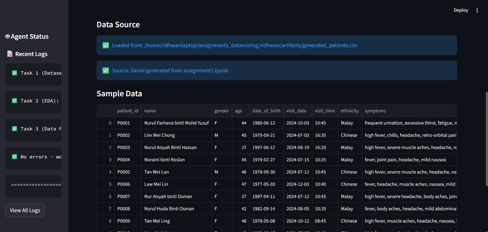
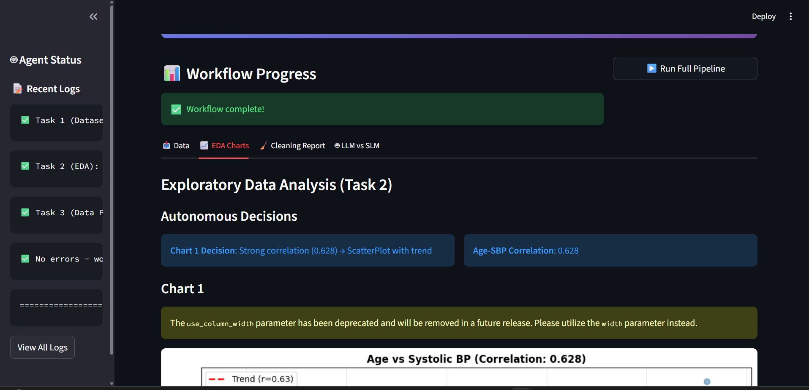
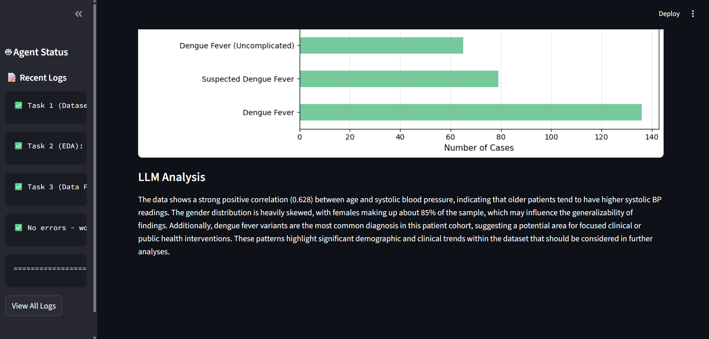
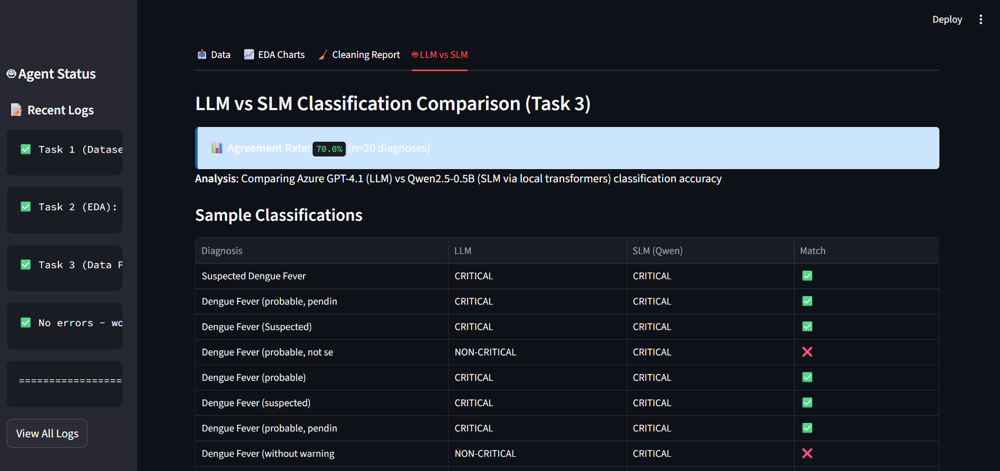

# Medical Data Analysis: Assignment 1 + Agentic AI Pipeline

A university assignment (WQD7005) implementing medical data analysis with an autonomous AI agent system. The project combines a foundational data pipeline with an advanced agentic AI approach using hybrid LLM/SLM architecture.

## Project Overview

This repository contains two integrated components:

1. **Assignment 1: Medical Data Analysis (Foundational)**
   - Dataset simulation with 500 synthetic patients (GenAI-generated)
   - Exploratory Data Analysis (EDA) with correlation analysis
   - Data cleaning and imputation strategy selection
   - Documented in `assignment1_main.ipynb`

2. **Agentic AI Medical Data Pipeline (Advanced)**
   - Autonomous orchestration using LangGraph state machines
   - Intelligent chart selection based on data patterns
   - Hybrid AI classification: Cloud LLM (Azure GPT-4.1) + Local SLM (Qwen2.5-0.5B)
   - Interactive Streamlit UI with real-time workflow execution
   - Complete audit trail and decision logging

## Quick Start

### Prerequisites

- Python 3.11+
- Conda package manager
- Azure OpenAI API credentials
- HuggingFace API token (optional for local model caching)

### Setup

1. **Clone and navigate to project**
   ```bash
   cd /path/to/assignment1_datamining/ridhwan
   conda create -n medical_data python=3.11
   conda activate medical_data
   pip install -r ai_agent/requirements.txt
   ```

2. **Configure API Credentials**

   Create a `.env` file in the `ai_agent/` directory:
   ```
   AZURE_OPENAI_ENDPOINT=https://your-resource.openai.azure.com/
   AZURE_OPENAI_KEY=your-key-here
   AZURE_OPENAI_DEPLOYMENT_NAME=gpt-4.1
   HUGGINGFACE_TOKEN=your-token-here (optional)
   ```

   **How to obtain credentials:**
   - **Azure OpenAI**: Visit [Azure Portal](https://portal.azure.com) → Create OpenAI resource → Copy endpoint and API key
   - **HuggingFace**: Visit [HuggingFace](https://huggingface.co/settings/tokens) → Create access token (read-only is sufficient)

3. **Run the Agentic AI Pipeline**
   ```bash
   cd ai_agent
   streamlit run app.py
   ```
   
   The Streamlit UI will open at `http://localhost:8502`. Click "Run Full Pipeline" to execute the complete workflow.

## Project Structure

```
ridhwan/
├── assignment1_main.ipynb           # Original assignment 1 (EDA, imputation, analysis)
├── README.md                         # This file
├── report.pdf                        # Detailed findings and analysis
├── src/
│   └── images/                       # Streamlit UI screenshots
│       ├── dataset_preview.png
│       ├── eda_preview.png
│       ├── llm_insights_from_charts.png
│       └── llm_vs_slm.png
├── ai_agent/                         # Agentic AI pipeline
│   ├── app.py                        # Streamlit frontend
│   ├── workflow.py                   # LangGraph workflow orchestration
│   ├── agents.py                     # Agent state & LLM/SLM clients
│   ├── tools.py                      # Data pipeline tools
│   ├── requirements.txt               # Python dependencies
│   └── .env.template                 # Environment variables template
└── artifacts/
    └── generated_patients.csv        # 500-patient synthetic dataset
```

## Technology Stack

| Component | Technology | Purpose |
|-----------|-----------|---------|
| **Orchestration** | LangGraph | State machine workflow management |
| **Cloud LLM** | Azure OpenAI (GPT-4.1) | Chart analysis, diagnosis interpretation |
| **Local SLM** | HuggingFace Transformers (Qwen2.5-0.5B) | Offline text classification (~500M params) |
| **UI Framework** | Streamlit | Interactive web interface |
| **Data Processing** | Pandas, NumPy, Scikit-learn | EDA, imputation, statistics |
| **Visualization** | Matplotlib, Seaborn | Chart generation |
| **State Persistence** | LangGraph MemorySaver | Workflow checkpointing |

## Agentic AI Approach

The system executes three tasks autonomously with decision-making at each step:

### Task 1: Data Loading & Validation
- Loads 500-patient synthetic dataset
- Validates schema and computes metadata statistics
- Output: Clean dataset with missing value analysis

### Task 2: Exploratory Data Analysis
- **Autonomous Decision**: If Age-Systolic BP correlation > 0.6, generate scatter plot with trendline; else boxplot
- **LLM Integration**: GPT-4.1 generates interpretation of chart patterns
- Output: 3 visualizations + natural language analysis

### Task 3: Data Cleaning & Classification
- **Autonomous Decision**: Select imputation strategy based on missingness percentage
  - <5% missing → Simple Mean Imputation
  - 5-20% missing → KNN Imputation
  - >20% missing → Iterative MICE
- **SLM Classification**: Qwen2.5-0.5B classifies diagnoses locally (offline)
- **LLM vs SLM Comparison**: Validates local model against GPT-4.1 baseline
- Output: Cleaned dataset + classification agreement metrics

## UI Workflow

The Streamlit interface displays results in 4 tabs:

1. **Data Tab** - Dataset overview, missing value analysis
2. **EDA Charts Tab** - Autonomous chart decisions, LLM interpretations
3. **Cleaning Report Tab** - Imputation strategy + before/after statistics
4. **LLM vs SLM Tab** - Classification comparison and agreement rates






## Key Features

- **Autonomous Decision-Making**: Chart selection and imputation strategy chosen algorithmically based on data
- **Hybrid AI Architecture**: Cloud LLM for reasoning + local SLM for efficiency
- **Explainability**: All decisions logged with justifications
- **Offline Capability**: Local SLM requires no internet after first model download
- **Cost-Conscious**: Minimal cloud API calls (3 LLM calls per run)
- **Fault Tolerance**: Workflow checkpointing via LangGraph
- **Reproducible**: Complete audit trail of all decisions

## Dependencies

See `ai_agent/requirements.txt` for complete list. Key packages:
- langgraph (workflow orchestration)
- streamlit (UI)
- transformers, torch (local ML model)
- pandas, numpy, scikit-learn (data processing)
- openai (Azure API client)
- python-dotenv (environment management)

## Running Tests

To verify imports and dependencies:
```bash
cd ai_agent
python3 -c "from agents import get_azure_client, get_local_slm_model, create_initial_state; print('All imports successful!')"
```

## Documentation

For detailed analysis, findings, and methodology, see:
- `report.pdf` - Complete assignment documentation with results
- `assignment1_main.ipynb` - Original EDA notebook with step-by-step analysis

## Notes

1. **First Run**: The local Qwen2.5-0.5B model (~300MB) will download on first execution. Subsequent runs use cached model.
2. **API Requirements**: Ensure AZURE_OPENAI_ENDPOINT and AZURE_OPENAI_KEY are correctly set before running.
3. **Workflow Time**: Complete pipeline takes 2-3 minutes on CPU (local model inference is the slowest component).
4. **Debugging**: All workflow decisions are logged in the sidebar logs panel within Streamlit.

## Author

Ridhwan

## License

University Assignment - WQD7005 Data Mining

---

**For detailed methodology and analysis, refer to `report.pdf`**
